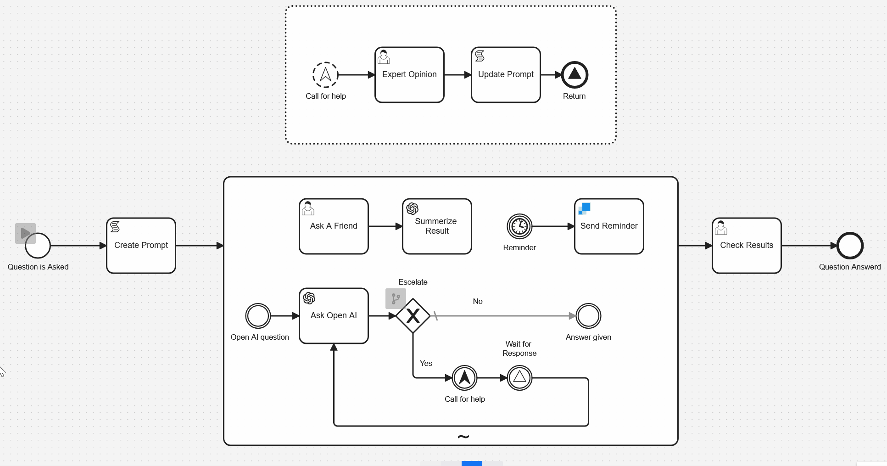

# Camunda Ad Hoc Example
This is an example of how you can use BPMN's adhoc subprocess to make for far more dynamic processes. 

## What it does
This is BPMN model that is executable by Camunda 8/Zeebe. It works by asking a user to ask a question via a front end and then they can select one or more services. 
1. Answer Question with AI
1. A Friend Answers the Question
1. Set a reminder about the question

An Ad-hoc subprocess then activates the tasks selected and runs them in parallel.

### Addional Functionality. 
1. Starting an event subprocess with an escelation event.
1. Wait and resume functionality with Signals
1. SendGrid Connector for sending emails
1. OpenAI Connector for geting ChatGPT prompts answered

## Instalation Instructions 

### Setup Required

This example requires a little bit of setup. You will need a Camunda 8 account (the easiest place to do that is [Camunda SaaS](https://signup.camunda.com/accounts)). You will also need to create a [SendGrid](https://sendgrid.com/en-us) account and you need to create a [OpenAI](https://openai.com/) Account. Then, you need to get an API key for both services.

### Setting up Secrets

🔐 It’s important to know that it’s best practice not to simply copy and paste this sensitive information directly into the model but rather to [create a secret](https://docs.camunda.io/docs/components/console/manage-clusters/manage-secrets/) for each of these in your Camunda cluster. Then you can reference it by typing `{{secrets.yourSecretHere}}` followed by the name of the key you want to access.

For this example to work you'll need to create secrets with the following names:

- OpenAI
- SendGrid

### How to Deploy it

Once you have both accounts, it's pretty easy to get started. Upload the BPMN model and the Forms from their respective folders and add them to the same project in you Camunda 8 account. From the modeler you can deploy the process to a cluster.

You can start the process from the Modeler or from Tasklist.
